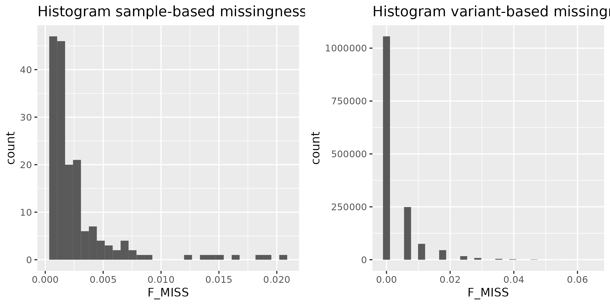
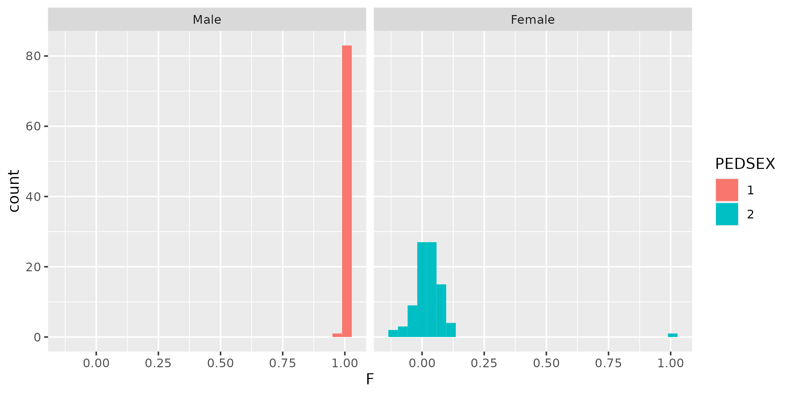
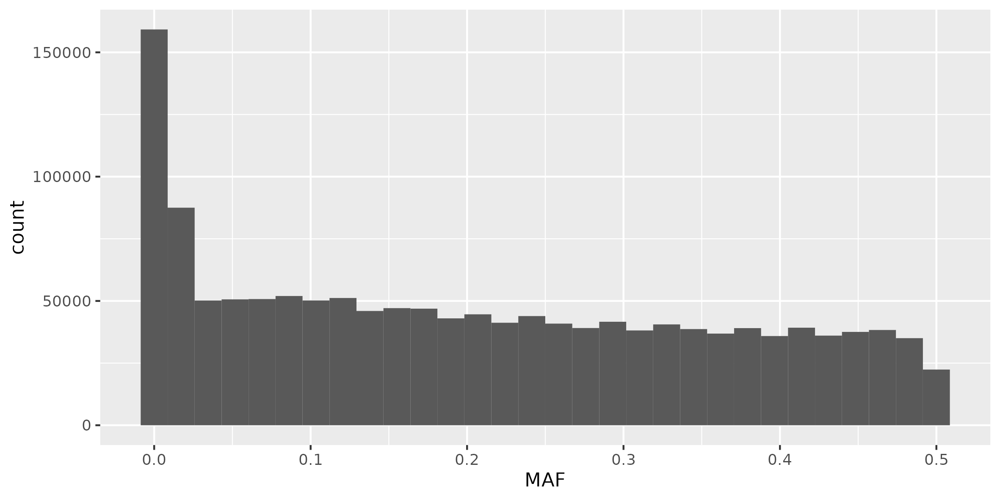
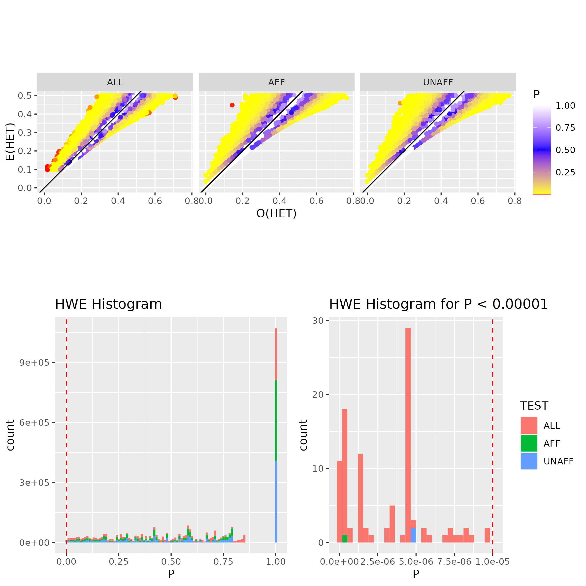
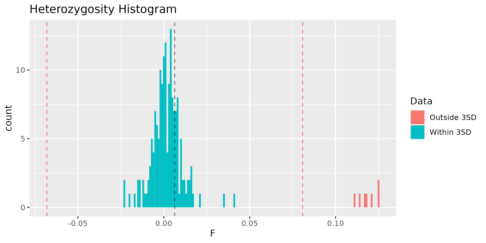
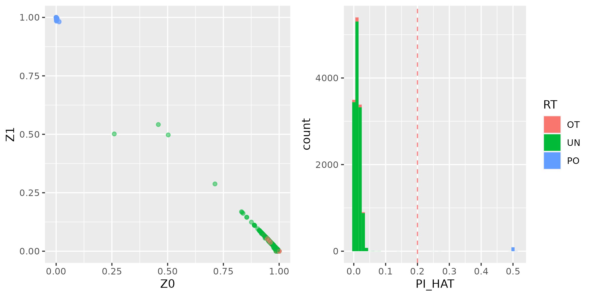

# Quality Control

You can find a thorough theoretical explanation of all QC steps in [A tutorial on conducting Genome-Wide-Association Studies: Quality control and statistical analysis.](https://www.ncbi.nlm.nih.gov/pubmed/29484742)

A vital step that should be part of any GWAS is the use of appropriate QC. Without extensive QC, GWAS will not generate reliable results because raw genotype data are inherently imperfect. Errors in the data can arise for numerous reasons, for example, due to poor quality of DNA samples, poor DNA hybridization to the array, poorly performing genotype probes, and sample mix-ups or contamination.

The QC steps consist of filtering out of SNPs and individuals based on the following:

- missingness
- inconsistencies in assigned and genetic sex of subjects (sex discrepancy)
- minor allele frequency (MAF)
- deviations from Hardy–Weinberg equilibrium (HWE)
- heterozygosity rate
- relatedness
- population stratification

Before starting tutorial let's change the current working directory to `gwas_exercises/out` from which we will run majority of commans.

    cd ~/gwas_exercises/out


---

## Missingness

First we can investigate missingness __per individual__ and __per SNP__ by making histograms. To do so we will use `--missing` in plink.

    plink --bfile ../data/hapmap --missing --out hapmap 

This will output two files: 
<br/>- `.imiss` contains information about the proportion of missing SNPs per individual (_"i" - individual_)
<br/>- `.lmiss` contains information about the proportion of missing individuals per locus (_"l" - locus_).

Now we can generate in R histograms to visualize the missingness results. We will use R script called `hist_miss.R`. This script will produce histograms for both `imiss` and `lmiss` files and output it as `hist_miss.png` in `out/plots`. Once you run the R script take a look at the figure.

    Rscript --vanilla ../scripts/hist_miss.R



In the next step we can delete SNPs (`--geno`) and individuals (`--mind`) with missingness `>0.2`.

    plink --bfile ../data/hapmap --geno 0.2 --mind 0.2 --make-bed --out hapmap_1

---

## Sex check 

In the next step we can check for sex discrepancies between genetic sex and reported sex. To do so we can use `--check-sex` to identify individual with discordant sex information. The `--check-sex` will calculate the __F value__ based on the X chromosome inbreeding (homozygosity) estimate.
<br/>- Females should have `F value < 0.2` 
<br/>- Males should have  `F value > 0.8` 

Individuals who do not fulfil these requirements are flagged with __"PROBLEM"__ by plink.

    plink --bfile hapmap_1 --check-sex --out hapmap_1

Generate plots to visualize the sex-check results.

    Rscript --vanilla ../scripts/sex_check.R



Inspection of `sex_check.png` plots shows that there is one individual indicated as female based on the pedsex with the F value of 0.99, and thus showing sex discrepancy. 

Depending on our main goal we can either choose to remove individuals with sex discrepeancy, or we can impute the sex of individuals based on the genotype information (`--impute-sex`). In our case, we will stick to more conservative approach and exclude individuals that showed sex discrepancy.

To delete individuals with sex discrepancy we will first make a list of problematic individuals based on `.sexcheck` file.

    awk '{if ($5 == "PROBLEM") print $1, $2}' hapmap_1.sexcheck > hapmap_1.sexcheck_problem

In the next step, we can use plink to `--remove` those individuals from our dataset.

    plink --bfile hapmap_1 --remove hapmap_1.sexcheck_problem --make-bed --out hapmap_2 

!!! note
    In case you would like to __impute-sex based on the genotype information__ you could run command like this:
    ```
    plink --bfile hapmap_1 --impute-sex --make-bed --out hapmap_2
    ```


---

## Autosomes

In this tutorial we will focus on autosomal SNPs. To keep only SNPs located on autosomal chromosomes (i.e. chromosomes 1-22) we can use `--autosomes` in plink. 


    plink --bfile hapmap_2 --autosome --make-bed --out hapmap_3

!!! note
    If chromosomes are not known one can provide a costum made list of SNPs to plink to be extracted (`--extract`) or excluded (`--exclude`).

---

## MAF

__Minor allele frequency (MAF)__ is the frequency of the least often occurring allele at a specific location. SNPs with a low MAF are rare, and most studies are underpowered to detect associations between SNP with low MAF and phenotype. These SNPs are also more prone to __genotyping errors__, and therefore they are often excluded. The appropriate MAF threshold depends on the sample size. Larger sample sizes can use lower MAF thresholds when compared with smaller sample sizes. Commonly used MAF threshold for __large sample sizes__ (N = 100.000) is __0.001__, and for __moderate sample sizes__ (N = 10.000) is __0.05__.

We can use plink's `--freq` to get a minor allele frequency report `.frq`.


    plink --bfile hapmap_3 --freq --out hapmap_3

We can then use this `.frq` report to generate a plot of the MAF distribution using the R script `maf_check.R`.

    Rscript --vanilla ../scripts/maf_check.R



In the next step we can remove SNPs with a low MAF frequency using `--maf` and desired threshold (in our case 0.05). 

    plink --bfile hapmap_3 --maf 0.05 --make-bed --out hapmap_4

!!! warning "Question"
    _How many variants were removed?_

---

## HWE


The Hardy–Weinberg principle states that __allele__ and __genotype__ frequencies in a population will remain constant from generation to generation in the absence of other evolutionary influences (i.e. genetic drift, mate choice, assortative mating, natural selection, sexual selection, mutation, gene flow, meiotic drive, genetic hitchhiking, population bottleneck, founder effect, inbreeding and outbreeding depression).

Violation of the HWE indicates that genotype frequencies are significantly different from expectations (e.g., if the frequency of allele Y = 0.70 and the frequency of allele y = 0.30; the expected frequency of genotype Yy is 2 x 0.7 x 0.3 = 0.42) and the observed frequency should not be significantly different. In GWAS, it is generally assumed that extreme deviations from HWE are the result of __genotyping errors__. The HWE thresholds in __cases__ are often less stringent than those in __controls__, as the violation of the HWE law in cases can be indicative of true genetic association with disease risk.

!!! note
    Even though HWE is commonly used as an indicator of __genotyping error__ it also can indicate presence of __evolutionary forces__ (e.g. selection) and one has to be carefule when excluding variants based on HWE. Genuine SNP-trait associations can be expected to deviate slightly from Hardy-Weinberg equilibrium, so it's dangerous to choose a threshold that filters out too many variants.

For __binary traits__ it is suggested to exclude variants with `HWE p value < 1e−10` in __cases__, and `HWE p value < 1e−6` in __controls__. For __quantitative traits__, we recommend excluding variants with `HWE p value <1e‐6`.

In the next step we will excludes SNPs which deviate from __Hardy–Weinberg equilibrium (HWE)__. We will assume that __poor genotype calling__ is the main reason for huge genotype frequencies deviations from HWE.

First we will create HWE report `.hwe` for each SNP in our dataset using plink's `--hardy`.

    plink --bfile hapmap_4 --hardy --out hapmap_4

Next we will use R to check the distribution of HWE p-values for all SNPs. R script `hwe.R` will produce `hwe_plots.png` containing 3 different plots.<br/>
<br/>i) Scatter plots of Observed "O(HET)" vs Expected "E(HET)" heterozygosities separately for affected (AFF), and unaffected (UNAFF), and all (ALL) individuals.
<br/>ii) Histogram of HWE p-values.
<br/>iii) Zoom-in-histogram for strongly deviating SNPs with HWE p-value below 0.00001. 

    Rscript --vanilla ../scripts/hwe.R



Finally, we can use `--hwe` to exclude SNPs deviating from HWE. By default the `--hwe` option in plink only filters for controls. It is recommended to remove SNPs that have a deviation from `HWE p < 10-6` in __controls__.

    plink --bfile hapmap_4 --hwe 10e-6 --make-bed --out hapmap_5

---

## LD pruning


As GWAS typically involve testing hundreds of thousands or even millions of genetic variants for association with a trait of interest, performing LD pruning can help to reduce the number of genetic variants included in the analysis while retaining most of the information captured by the remaining variants. This can reduce the number of multiple testing corrections required and improve the statistical power to detect true associations.

Additionally, LD pruning can help to remove genetic variants that are in high LD with each other, which are likely to provide redundant information in the analysis. This can reduce the risk of false positives and improve the interpretability of the results.

However, it is important to note that LD pruning may not always be necessary or appropriate for all GWAS datasets. The optimal parameters for LD pruning may vary depending on the genetic structure and sample size of the dataset, as well as the research question and hypothesis being tested. It is therefore important to carefully consider the potential benefits and drawbacks of LD pruning in the context of your specific GWAS analysis.

Therefore, to generate a list of SNPs that are not highly correlated with each other, we will prune the SNPs using `--indep-pairwise 50 5 0.2`. In this example, we've used the `--indep-pairwise` flag to perform LD pruning, where the parameters `50`, `5`, and `0.2` refer to __the window size__, __the step size__, and __the threshold for the multiple correlation coefficient r<sup>2</sup> LD values__, respectively. These values can be adjusted based on your dataset and research question.

    plink --bfile hapmap_5 --indep-pairwise 50 5 0.2 --out hapmap_5

Next we can use `--indep-pairwise` output files as input for `--extract`/`--exclude` to create file containing pruned set of SNPs.

    plink --bfile hapmap_5 --extract hapmap_5.prune.in --make-bed --out hapmap_6

---

## Heterozygosity


__Heterozygosity__ is the carrying of two different alleles of a specific SNP. The heterozygosity rate of an individual is the proportion of heterozygous genotypes, and thus it is recommended to remove individuals who deviate __±3 SD__ from the samples' heterozygosity rate mean.
- __High__ levels of heterozygosity within an individual might be an indication of __low sample quality__. 
- __Low__ levels of heterozygosity within an individual might be due to __inbreeding__.

It is recommended to perform checks for heterozygosity on a set of SNPs which are not highly correlated (i.e. LD pruned). We can use flag `--het` to compute observed and expected autosomal homozygous genotype counts for each sample, and __method-of-moments F coefficient estimates__.

    plink --bfile hapmap_6 --het --out hapmap_6

Once we calculated heterozygosity, we can use R script `het_check.R` to generate a list of individuals who deviate more than 3 standard deviations from the mean F in file `hapmap_6.het_fail_ind`. This script will also plot histogram for F in file `hist_F.png`. 

    Rscript --vanilla ../scripts/het_check.R



Finally after inspecting the plot we can remove individuals that are heterozygosity rate outliers.

    plink --bfile hapmap_6 --remove hapmap_6.het_fail_ind --make-bed --out hapmap_7

---

## Relatedness

It is essential to check datasets you analyse for cryptic relatedness as they can interfere with the association analysis.

If you have a family‐based sample (e.g., parent‐offspring), you do not need to remove related pairs but the statistical analysis should take family relatedness into account. 

However, for a population based sample (withouth known relatives) you can use plink's `--genome` to explore genetic relatedness among individuals based on __Pi-hat__ and __IBD__ values.

__IBD__ (identity-by-descent) is a measure of the probability that two individuals share a common ancestor for a given segment of DNA. In plink, IBD is estimated using a method called __identity-by-state (IBS)__, which compares the genotypes of two individuals at each SNP marker to determine if they match. If the genotypes match, it suggests that the two individuals share a common ancestor for that segment of DNA, but not necessarily recent ancestry.


__Pi-hat__ is defined as the proportion of alleles that are identical by descent (IBD) between two individuals, and it is calculated as: `P(IBD=2) + 0.5 * P(IBD=1)`. Pi-hat values range from `0` to `1`, with values closer to 1 indicating higher levels of genetic similarity.


Let's calculate IBD and Pi-hat:

    plink --bfile hapmap_7 --genome --out hapmap_7

This command will output `hapmap_7.genome` which contains pairwise information about relatedness between pairs of individuals. Important columns for understanding the output are:
- `Z0 = P(IBD=0)` - probability that at a given locus __0__ alleles are identical by descent.
- `Z1 = P(IBD=1)` - probability that at a given locus __1__ allele is shared.
- `Z2 = P(IBD=2)` - probability that at a given locus __2__ alleles are shared.
- `PI_HAT = P(IBD=2) + 0.5*P(IBD=1)` - Proportion of alleles that are IBD.

In the next step we can use R script `genome.R` to generate plots to assess the relationship between individuals. 

    Rscript --vanilla ../scripts/genome.R



Generated plots show a considerable amount of related individuals in the HapMap data, this is expected since the dataset was constructed as such. As expected, known PO (Parent-Offspring) pair shows highest PI_HAT and Z1 values (ideal parent-offspring has (Z0, Z1, Z2) = (0, 1, 0), i.e. all loci have one allele identical by descent).

Since majority of the relatedness was due to known parent-offspring pairs you can filter your dataset to include only founders (individuals without parents in the dataset) using `--filter-founders`. This flag will excludes all samples with at least one known parental ID from the current analysis.

    plink --bfile hapmap_7 --filter-founders --make-bed --out hapmap_8

Now after keeping only founders let's see if there is any criptic relatedness remaining in our dataset (i.e. pairs of individuals with with a `pihat > 0.2`).

    plink --bfile hapmap_8 --genome -min 0.2 --out hapmap_8.min_pihat_02

We can see that there is still one pair of individuals with pi-hat value higher than 0.2.

We can use the `--rel-cutoff` flag to remove one of the individuals from the related pairs (in case of multiple related pairs plink will try to maximize the final sample size by prioritizing removal of individuals related to multiple individuals in dataset):

    plink --bfile hapmap_8 --rel-cutoff 0.2 --make-bed --out hapmap_9

Congratulations! You've just succesfully completed the first tutorial! You are now able to conduct a proper QC.

---