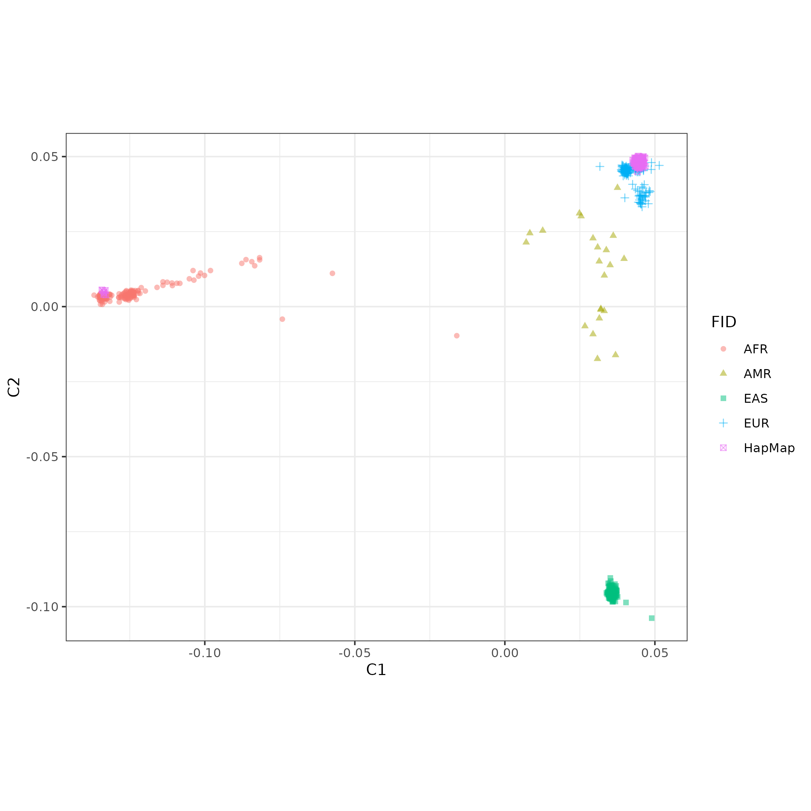

# Population stratification

__Population stratification__ is the presence of multiple subpopulations (e.g., individuals with different ethnic background) in a study. Because allele frequencies can differ between subpopulations, population stratification can lead to false positive associations and/or mask true associations. An excellent example of this is the __chopstick gene__, where a SNP, due to population stratification, accounted for nearly half of the variance in the capacity to eat with chopsticks [(Hamer & Sirota, 2000)](https://www.nature.com/articles/4000662).

There are several methods to correct for population stratification. In this tutorial, we will illustrate a method that is incorporated in `plink`: __the multidimensional scaling (MDS)__ approach. This method calculates the genome‐wide average proportion of alleles shared between any pair of individuals within the sample to generate quantitative indices (components) of the genetic variation for each individual. The individual component scores can be plotted to explore whether there are groups of individuals that are genetically more similar to each other than expected. For example, in a genetic study including subjects from Asia and Europe, MDS analysis would reveal that Asians are genetically more similar to each other than to Europeans. To investigate if there is population structure within a dataset, or if there are any individuals that deviate considerably fromt the rest of the sample it is helpful to use a referene pannel with known populations such as 1KGP (also called __anchoring__). Anchoring enables us not only to obtain information on getic background of studied individuals, but also to determine possible outliers. Individuals who are outliers based on the MDS analysis should be removed from further analyses. After the exclusion of these individuals, a new MDS analysis should be conducted, and its main components should to be used as __covariates__ in the association tests in order to correct for any remaining population stratification within the studied population. How many components need to be included depends on the population structure and the sample size, but the inclusion of up to 10 components is generally accepted.

In this tutorial we are going to check for population stratification in our HapMap dataset by anchoring it with the help of the __1000 Genomes Project (1KGP)__. This will help us to determine individuals with a non-European genetic background and to filter them out. At the end will generate a __covariate file__ which will help us to adust for remaining population stratification within the European subjects.

To performe this tutorial you will need the files present in `gwas_intro/exercises/data` directory.

----

## Upadate HapMap FID

Before merging we will "update" HapMap FID (i.e. overwrite the real FID) to contain indication that samples are comming from HapMap dataset and this will help us to identify them in merged dataset by simply looking at in the `fam` file.

    cd ~/gwas_exercises/out
    
    awk 'FS=" " {print $1, $2, "HapMap", $2}' ../data/hapmap.fam > hapmap_update_IDs

    plink --bfile ../data/hapmap --update-ids hapmap_update_IDs --make-bed --out hapmap_mds

----

## Merge HapMap with 1KGP

While merging the two datasets we will also extract the variants present in 1KGP dataset from the HapMap dataset.

    awk '{print $2}' ../data/1kgp.bim > 1kgp.SNPs
    
    plink --bfile hapmap_mds --bmerge ../data/1kgp --extract 1kgp.SNPs --make-bed --out merge_mds

----

## QC on merged dataset

After merging, we will perform quick QC on the merged dataset. We will remove individuals and variants based on missingness, and variants based on MAF.

    plink --bfile merge_mds --mind 0.2 --geno 0.2 --maf 0.05 --allow-no-sex --make-bed --out merge_mds_qc

----

## MDS on merged dataset

Before running MDS we will LD prune the data.

    plink --bfile merge_mds_qc --indep-pairwise 50 5 0.2 --out merge_mds_qc

    plink --bfile merge_mds_qc --extract merge_mds_qc.prune.in --make-bed --out merge_mds_qc_pruned

    plink --bfile merge_mds_qc_pruned --genome --out merge_mds_qc_pruned

    plink --bfile merge_mds_qc_pruned --read-genome merge_mds_qc_pruned.genome --cluster --mds-plot 10 --out merge_mds_qc_pruned

Now we can use our R script to plot mds.
    
    Rscript --vanilla ../scripts/mds.R

The `mds_plot.png` shows that majority of our "HapMap" data falls within the European (EUR) individuals of the 1KGP data. However, we can see that few individuals are withing Africans (which were left in dataset on purpose as ouliers). We will exclude them in next couple of steps. 

----

### Exclude outliers from HapMap data

We will use first two dimensions of MDS plot to define outliers. We will select individuals in HapMap data that cluster within other European samples present in 1KGP. The cut-off levels are not fixed thresholds and you will have to be determined them based on the visualization of the first two dimensions. To exclude outliers, the thresholds needs to be set around the cluster of individuals of interest. In our case majority of our individuals fall within Europeans and only few within African individuals from 1KGP.

    grep -f <(awk '{ if ($1 == "HapMap" && $4 >0.04 && $5 >0.03) print $2 }' merge_mds_qc_pruned.mds) hapmap_9.fam > EUR_samples

Extract these individuals in HapMap data.

    plink --bfile hapmap_9 --keep EUR_samples --make-bed --out hapmap_gwa

As we can see all of those individuals were removed in our QC, but in reality this might not be the case.

----

### MDS on European HapMap

We will perform additional MDS analysis on the filltered HapMap datast without outliers. We will then use the values of the 10 MDS dimensions as covariates in the association analysis in the next tutorial.

    plink --bfile hapmap_gwa --genome --out hapmap_gwa

    plink --bfile hapmap_gwa --read-genome hapmap_gwa.genome --cluster --mds-plot 10 --out hapmap_gwa

Now we can use our R script to plot mds.
    
    Rscript --vanilla ../scripts/mds_EUR.R

----

### Create covariates based on MDS

Change the format of the `.mds` file into a plink covariate file.

    awk '{print$1, $2, $4, $5, $6, $7, $8, $9, $10, $11, $12, $13}' hapmap_gwa.mds > hapmap_gwa.covar

In the next tutorial we will use the values in `hapmap_gwa.covar` as covariates in order to adjust for remaining population stratification.

----