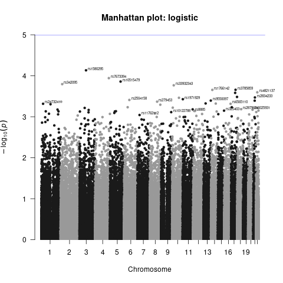
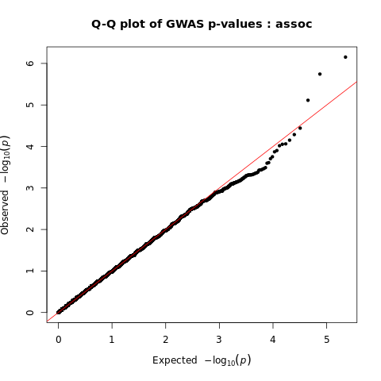

# Association analyses

After QC and calculation of MDS components, the data are ready for subsequent association tests. Depending on the expected genetic model of the trait or disease of interest and the nature of the phenotypic trait studied, the appropriate statistical test can be selected. 

Plink offers one degree of freedom (1 df) __allelic tests__ in which the trait value, or the log-odds of a binary trait, increases or decreases linearly as a function of the number of risk alleles (minor allele `a` vs. major allele `A`). 

In addition, __non-additive tests__ are available, for instance: 
 - __the genotypic association test__ (2 df: `aa` vs. `Aa` vs. `AA`), 
 - __the dominant gene action test__ (1 df: `aa & Aa` vs. `AA`), and 
 - __the recessive gene action test__ (1 df: `aa` vs. `Aa & AA`).  
  
However, non-additive tests are not widely applied, because the statistical power to detect non-additivity is low in practice. More complex analyses (e.g., _Cox regression analysis_ and _cure models_) can be performed by using R-based “plug-in” functions in plink.

----

## Association analyses for quantitative traits

Within `plink`, the association between SNPs and __quantitative outcome__ measures (e.g. the height; the number of alcoholic beverages consumed per week...) can be tested with the options `--assoc` and `--linear`. 

-  The `--assoc` option will automatically detect a quantitative outcome measure (i.e., values other than 1, 2, 0, or missing) and it will perform an __asymptotic version of the usual Student's t test__ to compare two means. This option _does not allow the use of covariates_. 
- The `--linear` option performs a __linear regression analysis__ with each individual SNP as a predictor. This option _allows the the inclusion covariates_ but it is somewhat slower than the `--assoc` option.

----

## Association analyses for binary traits

Within `plink`, the association between SNPs and a __binary outcome__ (e.g. disliking vs. liking cilantro; alcohol dependent patients vs. healthy controls...) can be tested with the options `--assoc` or `--logistic`.

- The `--assoc` option performs a __X^2 test of association__ that _does not allow the inclusion of covariates_. 
- The `--logistic` option performs a __logistic regression analysis__ that _allows the inclusion of covariates_. 

The `--logistic` option is more flexible than the `--assoc` option, yet it comes at the price of increased computational time.

In this tutorial, we will focus only on binary traits (e.g. disliking vs. liking cilantro).

!!! note
    The default phenotype codes in plink are: 
     `1` = __unaffected__
     `2` = __affected__
     `0` or `−9` = __missing__  

----

### `--assoc`

Given a case/control phenotype, `--assoc` writes the results of a 1df chi-square allelic test to `.assoc` file. This output file contains a header line, and then one line per variant with the following fields:

|       |                                                       |
|:------|:------------------------------------------------------|
| CHR   | Chromosome code                                       |
| SNP   | Variant identifier                                    | 
| BP    | Base-pair coordinate                                  | 
| A1	| Allele 1 (usually minor)                              |
| F_A	| Allele 1 frequency among cases                        |
| F_U	| Allele 1 frequency among controls                     |
| A2	| Allele 2                                              |
| CHISQ	| Allelic test chi-square statistic.                    |
| P	    | Allelic test p-value                                  |
| OR	| odds(allele 1 in case) / odds(allele 1 in control)    |

    cd ~/gwas_exercises/out

    plink --bfile hapmap_gwa --assoc --out assoc_results

!!! note
    The `--assoc` option __does not allow to correct covariates__ such as principal components (PCs) or MDS components, which makes it _less suited for association analyses_.

----

### `--logistic`

given a case/control phenotype and some covariates `--logistic` performs logistic regression. We will be using 10 MDS components calculated from the previous tutorial as covariates in this logistic analysis. This output file contains a header line, and then one line per variant with the following fields:

|       |                                                                           |
|:------|:--------------------------------------------------------------------------|
| CHR   |	Chromosome code. Not present with 'no-snp' modifier.                    |
| SNP   |	Variant identifier. Not present with 'no-snp'.                          |
| BP    |	Base-pair coordinate. Not present with 'no-snp'.                        |
| A1    | 	Allele 1 (usually minor). Not present with 'no-snp'.                    |
| TEST  |	Test identifier                                                         |
| NMISS |	Number of observations (nonmissing genotype, phenotype, and covariates) |
| OR    |	Odds Ratio (--logistic without 'beta')                                  |
| STAT  |	T-statistic                                                             |
| P     |	Asymptotic p-value for t-statistic                                      |

    plink --bfile hapmap_gwa --covar hapmap_gwa.covar --logistic --hide-covar --out logistic_results

!!! note
    `--hide-covar` removes covariate-specific lines from the main report. 

Remove `NA` values, those might give problems generating plots in next steps

    awk '!/'NA'/' logistic_results.assoc.logistic > logistic_results.assoc_2.logistic

The results obtained from these GWAS analyses will be visualized in the last step. This will also show if the data set contains any genome-wide significant SNPs.

----

## Multiple testing

Modern genotyping arrays can genotype millions of markers, which generates a large number of tests, and thus, a considerable __multiple testing burden__. SNP imputation may further increase the number of tested associations. Various simulations have indicated that the widely used __genome-wide significance threshold__ of `5×10−8` for studies on European populations adequately controls for the number of independent SNPs in the entire genome, regardless of the actual SNP density of the study. When testing African populations, more stringent thresholds are required due to the greater genetic diversity among those individuals.

Three widely applied alternatives for determining genome-wide significance are the use of __Bonferroni correction__, __Benjamini–Hochberg false discovery rate (FDR)__, and __permutation testing__. 

- __The Bonferroni correction__ aims to control the probability of having at least one false positive finding. It calculates the adjusted p value threshold with the formula `0.05/n`, with `n` being the number of SNPs tested. However, as stated previously, many SNPs are correlated, due to __Linkage Disequilibrium (LD)__ and are thus by definition not independent. Therefore, this method is often _too conservative_ and leads to an _increase in the proportion of false negative findings_.

- __FDR__ controls the expected proportion of false positives among all signals with an FDR value below a fixed threshold, assuming that SNPs are independent. This method is _less conservative_ than Bonferroni correction. It should be noted that controlling for FDR does not imply any notion of statistical significance; _it is merely a method to minimize the expected proportion of false positives_, for example, for follow-up analyses. Moreover, this method has its own limitation as SNPs and thus p values are not independent whereas this is an assumption of the FDR method. 

- __Permutation methods__ can be used to deal with the multiple testing burden. To calculate __permutation-based p values__, the outcome measure labels are randomly permuted multiple (e.g., 1,000–1,000,000) times which effectively removes any true association between the outcome measure and the genotype. For all permuted data sets, statistical tests are then performed. This provides the empirical distribution of the test-statistic and the p values under the null hypothesis of no association. The original test statistic or p value obtained from the observed data is subsequently compared to the empirical distribution of p values to determine an empirically adjusted p value. 

----

### `--adjust`

To easily apply Bonferroni and FDR correction, `plink` offers the option `--adjust` that generates output in which the unadjusted p value is displayed, along with p values corrected with various multiple testing correction methods.

    plink --bfile hapmap_gwa -assoc --adjust --out adjusted_assoc_results

This file gives a __Bonferroni corrected p-value__, along with __FDR__ and others.

----

### Permutation

To perform __permutation test__ in `plink`, options `--assoc` and `--mperm` can be combined to generate two p values: 
 - __EMP1__, the empirical p value (uncorrected), and 
 - __EMP2__, the empirical p value corrected for multiple `testing. 

This procedure is computationally intensive, especially if many permutations are required, which is necessary to calculate very small p values accurately.

To reduce computational time we will perform this test only on a subset of the SNPs from chromosome 22.

Generate subset of SNPs from chromosome 22

    plink --bfile hapmap_gwa --chr 22 --make-bed --out hapmap_gwa_chr22subset

Perform 1000000 perrmutations

    plink --bfile hapmap_gwa_chr22subset --assoc --mperm 1000000 --out hapmap_gwa_chr22subset

Order your data, from lowest to highest p-value and check ordered permutation results

    sort -gk 4 hapmap_gwa_chr22subset.assoc.mperm | head

----

## Generate Manhattan and QQ plots

We will visualize the output of the association analysis with __Manhattan plot__ and __quantile–quantile plot__ using R script `manhattan_qq.R`.

    Rscript --vanilla ../scripts/manhattan_qq.R

__Manhattan plots__ show us the significance of each variant’s association with a phenotype (e.g. disliking vs. liking cilantro). Each dot represents a single-nucleotide polymorphism (SNP). SNPs are ordered on the _x axis_ according to their genomic position. _y axis_ represents strength of their association measured as __–log10 transformed P values__. Blue line marks genome-wide significance threshold of __P < 5 × 10–8__. 

__Quantile–quantile plots__ show us distribution of __expected P values__ under a null model of no significance versus __observed P values__. Expected –log10 transformed P values (_x axis_) for each association are plotted against observed values (_y axis_) to visualize the enrichment of association signal. Deviation from the expectation under the null hypothesis (red line) indicates the presence of either __true causal effects__ or __insufficiently corrected population stratification__. In the case of true causal effects, one would expect to observe this deviation mostly at the right side of the plot, whereas population stratification causes the deviation to start closer to the origin. In this case, BMI is extremely polygenic and the genome-wide association study (GWAS) was highly powered, which may also cause the deviation to start close to the origin, making it difficult to visually spot stratification. [LDSC](https://github.com/bulik/ldsc) may be used to assess whether this inflation is due to bias or polygenicity.

{width=45%} 
{width=45%}

{width=45%}
{width=45%}

{width=45%}

----