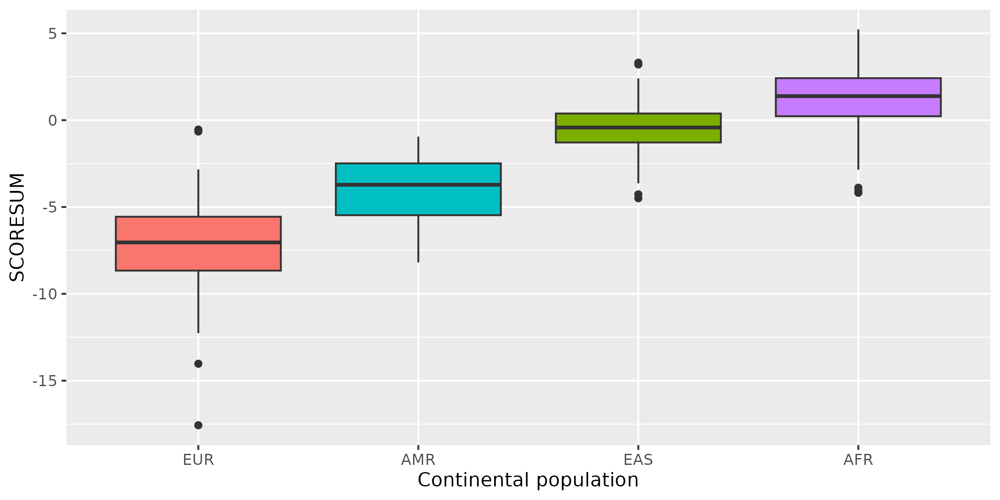

# PGS

A __polygenic score (PGS)__ or __polygenic risk score (PRS)__ is an estimate of an individual’s genetic liability to a trait or disease, calculated according to their genotype profile and relevant genome-wide association study (GWAS) data. While present PGSs typically explain only a small fraction of trait variance, their correlation with the single largest contributor to phenotypic variation—genetic liability—has led to the routine application of PGSs across biomedical research. Among a range of applications, PGSs are exploited to assess shared etiology between phenotypes, to evaluate the clinical utility of genetic data for complex disease and as part of experimental studies in which, for example, experiments are performed that compare outcomes (e.g., gene expression and cellular response to treatment) between individuals with low and high PGS values. As GWAS sample sizes increase and PGSs become more powerful, PGSs are set to play a key role in research and stratified medicine. However, despite the importance and growing application of PGSs, there are limited guidelines for performing PGS analyses, which can lead to inconsistency between studies and misinterpretation of results. 

While genome-wide complex trait analysis, __LD score regression__ and PGS can all be exploited to infer heritability and shared etiology among complex traits, PGS is the only approach that provides an estimate of genetic liability to a trait at the individual level. In the __classic PGS method__ (commonly known as the clumping + thresholding i.e. __C+T method__), a polygenic risk score is calculated by computing the sum of risk alleles that an individual has, weighted by the risk allele effect sizes as estimated by a GWAS on the phenotype. The method involves computing PGSs based on a subset of partially independent (__clumped__) SNPs exceeding a specific GWAS association P value threshold. PGS values are computed in relation to a hypothetical individual with the non-effect allele at every SNP, and, thus, they provide only a relative (compared to other individuals) estimate of risk (or trait effect) rather than an absolute estimate.

As GWAS sample sizes increase, polygenic scores are likely to play a central role in the future of biomedical research and personalized medicine. However, the efficacy of their use will depend on the continued development of methods that exploit them, their proper analysis and appropriate interpretation and an understanding of their strengths and limitations.

The use of summary statistic data for the genotype effect size estimates distinguishes polygenic scores from __phenotypic prediction__ approaches that exploit individual-level data only.

----

__Polygenic score (PGS)__ is a single value that quantifies an individual’s genetic predisposition to a trait. Typically calculated by summing the number of trait-associated alleles in an individual weighted by per-allele effect sizes from a discovery GWAS, and normalized using a relevant population distribution. Sometimes referred to as a __genetic score__.

__Polygenic risk score (PRS)__ is a subset of PGS that is used to estimate the risk of disease or other clinically relevant outcomes (binary or discrete). Sometimes referred to as a __genetic or genomic risk score (GRS)__. See categories below.

----

# PGS in plink

[plink](https://zzz.bwh.harvard.edu/plink/profile.shtml) provides a convenient function `--score` and `--q-score-range` for calculating polygenic scores.

---------------------------------------------------------------------------------------------------------------------

# PGS UK-Biobank

## Downloading summary statistics

In this tutorial we will work with summary statistics from UK Biobank GWAS for skin color (data field 1717) from the publicly available release by the Neale Lab [(version 3, Manifest Release 20180731)](https://docs.google.com/spreadsheets/d/1kvPoupSzsSFBNSztMzl04xMoSC3Kcx3CrjVf4yBmESU/edit#gid=227859291). This GWAS measured self-reported skin color as a categorical variable (very fair, fair, light olive, dark olive, brown, black). In this file the reported beta values show estimated effect size of __alt allele__.

    cd ~/gwas_exercises/out

    wget https://broad-ukb-sumstats-us-east-1.s3.amazonaws.com/round2/additive-tsvs/1717.gwas.imputed_v3.both_sexes.tsv.bgz -O 1717.gwas.imputed_v3.both_sexes.tsv.bgz

We will also download file contains annotations for each variant in the GWAS.

    wget https://broad-ukb-sumstats-us-east-1.s3.amazonaws.com/round2/annotations/variants.tsv.bgz -O variants.tsv.bgz

The order of variants in `variants.tsv` file matches the order of variants in the `1717.gwas.imputed_v3.both_sexes.tsv` file. To join these annotations with a results file, we can either match on the "variant" field or simply paste the columns together (and extract from each file only columns relevant for us) e.g.   

    paste <(zcat variants.tsv.bgz | cut -f5,6) <(zcat 1717.gwas.imputed_v3.both_sexes.tsv.bgz | cut -f8,11) | awk '{print $2,$1,$3,$4}' > skincolor.tsv

## QC summary statistics

We will extract only unique SNPs present in 1KGP from summary statistics.
    
    echo -e "rsid\talt\tbeta\tpval" > skincolor_QC.tsv

    grep -wf <(cut -f2 ../data/1kgp_0.bim) skincolor.tsv | awk '!seen[$1]++' >> skincolor_QC.tsv

## Clumping

To identify genome-wide significant and independent SNPs, we will performe clumping using `plink` with 1000 Genomes Project as an LD reference panel.

And then performe clumping.

    plink \
        --bfile ../data/1kgp \
        --clump skincolor_QC.tsv \
        --clump-p1 5.0e-8 \
        --clump-r2 0.5 \
        --clump-kb 100 \
        --clump-snp-field rsid \
        --clump-field pval \
        --out 1kgp

This will generate `1kgp.clumped` file, containing the index SNPs after clumping is performed. We can extract the index SNP ID by performing the following command ($3 because the third column contains the SNP ID):

    awk 'NR!=1{print $3}' 1kgp.clumped >  1kgp.clumped.snp

## PGS calculation
    
    plink \
        --bfile ../data/1kgp \
        --score skincolor_QC.tsv 1 2 3 sum header \
        --extract 1kgp.clumped.snp \
        --out pgs_1kgp

We can quickly sort based on the predicted value and see that there seem to be a geographic pattern. EUR samples tend to have lower values while AFR samples have higher values.

    sort -gk 6 pgs_1kgp.profile

We can inspect how this PGS is distributed across world populations.

    Rscript --vanilla ../scripts/plot_pgs.R

!!! warning "Homework"
    By default, if a genotype in the plink's `--score` is missing for a particular individual, then the expected value is imputed, i.e. based on the sample allele frequency. To change this behavior, we can add the flag  `--score-no-mean-imputation`. Calculate PGS as above but this time add `--score-no-mean-imputation` and compare the results.

---------------------------------------